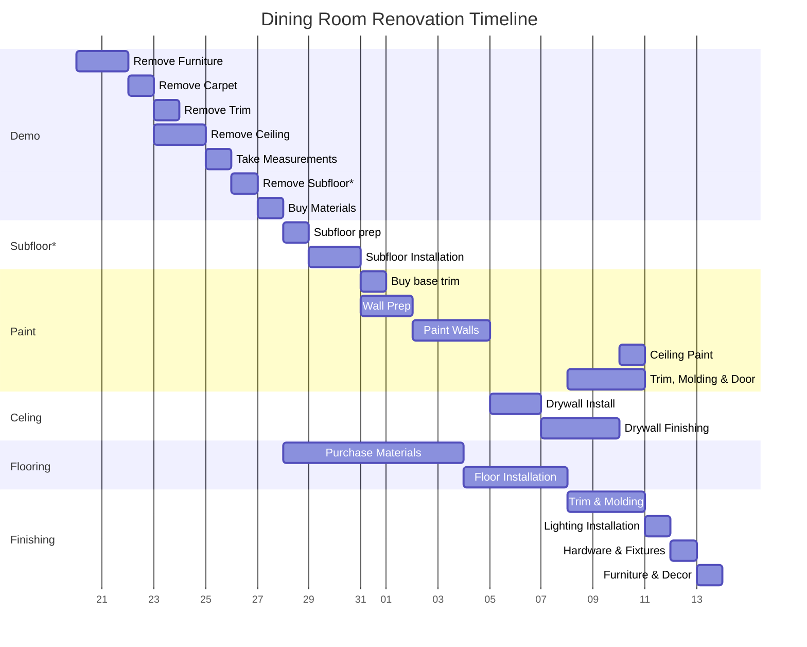

## Renovation Timeline

```mermaid
gantt
    title Dining Room Renovation Timeline
    dateFormat YYYY-MM-DD
    axisFormat %d
    section Demo
    Remove Furniture                :a1, 2025-10-20, 2d
    Remove Carpet                   :a2, after a1, 1d
    Remove Trim                     :a3, after a2, 1d
    Remove Ceiling                  :a4, after a2, 2d
    Take Measurements               :a5, after a4, 1d
    Remove Subfloor*                :a6, after a5, 1d
    Buy Materials                   :a7, after a6, 1d
    
    section Subfloor*
    Subfloor prep                   :b1, after a7, 1d
    Subfloor Installation           :b2, after b1, 2d
    
    section Paint
    Buy base trim                   :c1, after b2, 1d
    Wall Prep                       :c2, after b2, 2d
    Paint Walls                     :c3, after c2, 3d
    Ceiling Paint                   :c4, after d2, 1d
    Trim, Molding & Door            :c5, after e2, 3d
    
    section Celing
    Drywall Install                 :d1, after c3, 2d
    Drywall Finishing               :d2, after d1, 3d
    
    section Flooring
    Purchase Materials              :e1, after a7, 7d
    Floor Installation              :e2, after e1, 4d
    
    section Finishing
    Trim & Molding                  :g1, after e2, 3d
    Lighting Installation           :g2, after g1, 1d
    Hardware & Fixtures             :g3, after g2, 1d
    Furniture & Decor               :g4, after g3, 1d
```

## Project Materials To Purchase
