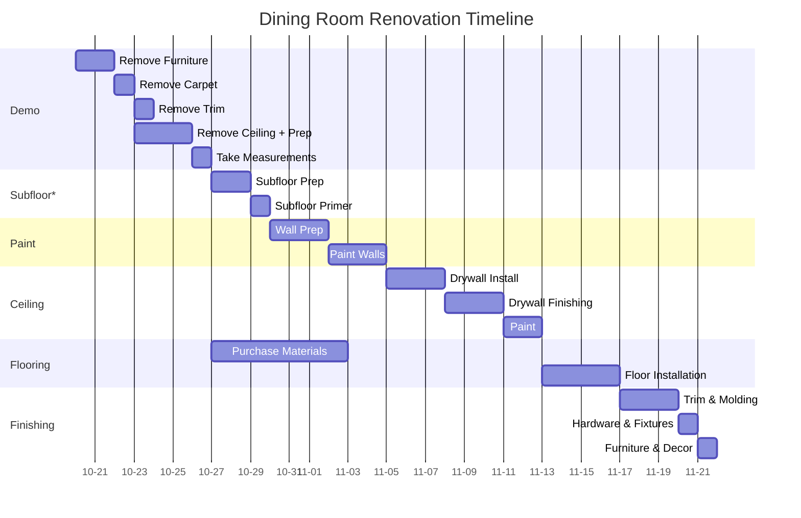

## Renovation Timeline

## Project Materials To Purchase

- [x] Zipper for plastic
- [x] Subfloor materials
- [ ] Celing Drywall
    - [ ] Sanding vacuum attachment
- [ ] Baseboard Trim
- [ ] Paint & Primer & Rollers
- [ ] Flooring & Molding/Transition